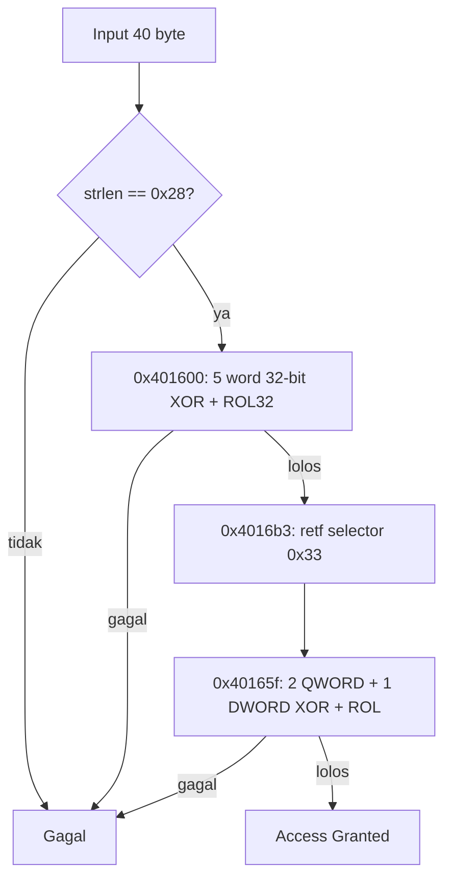

# Two Worlds, One Heart — Reverse Writeup

> Kategori: Reverse Engineering  
> Target: `portal33.exe`  
> Analisis: 2026-09-12  
> Lingkungan: offline CTF sandbox

## Ringkasan

`portal33.exe` meminta input sepanjang tepat 40 karakter. Lima word pertama dicek sebagai operasi XOR dan `ROL` 32-bit, kemudian 20 karakter sisanya diproses melalui jalur `retf` yang menjalankan kode 64-bit. Karena XOR dan rotasi bit bersifat invertible, semua nilai input dapat dipulihkan langsung dari konstanta `cmp` di binary. Hasil inversi dan replay forward menghasilkan flag yang sama dengan isi `solvedflag.txt`.


Evidence utama:

| ID | Isi | Lokasi |
|---|---|---|
| E-001 | PE32, entry point, string sukses, dan SHA-256 sampel | E-001 |
| E-002 | Disassembly fungsi checker dan wrapper `retf` | E-002 |
| E-003 | Solver inverse + validasi semua konstanta | E-003 |

### F-001

- title: Checker 32-bit dan 64-bit ditemukan
- severity: n/a_re
- category: reverse_algo
- status: validated
- evidence_ids: [E-002, E-003]
- location: `portal33.exe:0x401600–0x4016b2`
- impact: Input harus memenuhi dua rangkaian validasi pada mode CPU yang berbeda.
- confidence: high
- repro_steps: Lihat disassembly pada E-002 dan replay pada E-003.
- remediation: n/a for pure RE

### F-002

- title: Flag dapat dipulihkan tanpa brute force
- severity: n/a_re
- category: reverse_algo
- status: validated
- evidence_ids: [E-002, E-003]
- location: `portal33.exe:0x401611–0x40164f` dan `0x40167b–0x4016a2`
- impact: Konstanta checker dapat dibalik menjadi input yang valid.
- confidence: high
- repro_steps: Jalankan solver inverse pada E-003.
- remediation: n/a for pure RE

### P-001

- title: Jalur penyelesaian flag
- path_type: solve
- start: Input buffer pada caller `0x408e1e`
- goal: Mendapatkan input yang menghasilkan `Access Granted`
- steps:
  1. action: Identifikasi input buffer dan pemeriksaan panjang — evidence: E-002 — finding: F-001
  2. action: Inversi lima transformasi 32-bit — evidence: E-002 — finding: F-001
  3. action: Inversi tiga transformasi 64-bit — evidence: E-002 — finding: F-001
  4. action: Gabungkan 20 + 20 byte dan replay semua transformasi — evidence: E-003 — finding: F-002
  5. action: Dapatkan flag — evidence: E-003 — finding: F-002
- residual_risks: Runtime Windows tidak dijalankan di Linux; validasi dilakukan dengan replay matematis terhadap seluruh konstanta.

## 1. Triage binary

Perintah awal:

```bash
file portal33.exe
sha256sum portal33.exe
strings -a portal33.exe | grep -E 'Two Worlds|Enter the words|Access Granted|You didn'
```

Hasil penting:

```text
PE32 executable for MS Windows 4.00 (console), Intel i386
SHA-256: d35911333fae7cfc7a305c93e2f14cad678487ef724d4ea610c3e047a42194f0
[+] Access Granted! Flag verified.
```

`public.zip` hanya berisi `portal33.exe`, jadi tidak ada source code atau file konfigurasi lain yang diperlukan.

## 2. Menemukan alur validasi

Caller membaca input dengan `fgets`, menghapus `\r`/`\n`, lalu membandingkan hasil `strlen` dengan `0x28` pada alamat `0x408e1e`:

```asm
0x408e11  mov byte [buffer + eax], 0
0x408e16  push buffer
0x408e19  call strlen
0x408e1e  cmp eax, 0x28
0x408e21  jne gagal
```

Jadi input wajib berukuran `0x28 = 40` byte.

Setelah length check, caller menjalankan checker dua kali:

```asm
0x408e23  call 0x401600       ; checker dalam mode 32-bit
0x408e37  call 0x4016b3       ; wrapper untuk jalur 64-bit
```

## 3. Bagian 32-bit

Pada mode 32-bit, checker membaca lima word little-endian dari offset `0x00`, `0x04`, `0x08`, `0x0c`, dan `0x10`. Bentuk umumnya:

```text
C0 = ROL32(W0 XOR 0x1337c0de, 11)
Ci = ROL32(Wi XOR C(i-1), 11), untuk i > 0
```

Nilai `Ci` berasal langsung dari instruksi `cmp`:

| Word | Konstanta pembanding | Word hasil inversi | ASCII |
|---:|---:|---:|---|
| 0 | `cdbd7302` | `736e7770` | `pwns` |
| 1 | `30833d2e` | `687b6365` | `ec{h` |
| 2 | `b310ea05` | `70355f33` | `3_5p` |
| 3 | `def1b433` | `356b3433` | `34k5` |
| 4 | `1c3b640e` | `5f32335f` | `_32_` |

Inverse yang dipakai:

```text
Wi = ROR32(Ci, 11) XOR keyi
key0 = 0x1337c0de
keyi = C(i-1), untuk i > 0
```

Karena data disimpan little-endian, word-word tersebut dibaca sebagai byte ASCII dan membentuk:

```text
pwnsec{h3_5p34k5_32_
```

## 4. Jalur `retf` dan bagian 64-bit

Byte `0x48` di awal checker memiliki arti berbeda bergantung pada mode CPU. Pada 32-bit, rangkaian awal menjadi `dec eax` dan eksekusi masuk ke blok 32-bit. Pada 64-bit, rangkaiannya adalah:

```asm
0x401600  xor eax, eax
0x401602  test rax, rax
0x401605  je 0x40165f
```

Dengan demikian, mode 64-bit langsung melompati blok 32-bit dan masuk ke `0x40165f`.

Wrapper di `0x4016b3` menyiapkan far return menggunakan selector `0x33`, memanggil alamat checker yang diberikan, lalu menggunakan `retf` lagi dengan selector `0x23` untuk kembali ke bagian 32-bit. Inilah makna “two worlds” pada judul challenge.

Alur sederhananya:



Bagian 64-bit membaca offset `0x14`, `0x1c`, dan `0x24`, sehingga tepat melengkapi 20 byte terakhir. Persamaannya:

```text
C0 = ROL64(input[0x14:0x1c] XOR 0x5a33c0d313379090, 19)
C1 = ROL64(input[0x1c:0x24] XOR C0, 29)
C2 = ROL32(input[0x24:0x28] XOR low32(C1), 13)
```

Konstanta pembanding dan inverse-nya:

| Nilai | Konstanta pembanding | Hasil inverse | Byte ASCII |
|---|---:|---:|---|
| `C0` | `87326027c52b7005` | `343370355f336835` | `5h3_5p34` |
| `C1` | `7e6e88add6ebc7e2` | `306c5f34365f356b` | `k5_64_l0` |
| `C2` | `5e929579` | `7d213376` | `v3!}` |

Catatan penting: saat menghitung `C1`, XOR dilakukan dengan hasil transformasi sebelumnya (`C0` sebagai nilai register `RAX` setelah `ROL`), bukan dengan plaintext delapan byte pertama. Hal yang sama berlaku untuk `C2`, yang memakai low 32-bit dari hasil `C1`.

Hasil 20 byte kedua:

```text
5h3_5p34k5_64_l0v3!}
```

## 5. Solver dan validasi

Solver lengkap tersedia di `E-003`


Inti inverse-nya adalah:

```python
def rol(x, n, bits):
    mask = (1 << bits) - 1
    return ((x << n) | (x >> (bits - n))) & mask

def ror(x, n, bits):
    return rol(x, bits - n, bits)
```

Replay forward menghasilkan:

```text
32-bit: cdbd7302, 30833d2e, b310ea05, def1b433, 1c3b640e
64-bit: 87326027c52b7005, 7e6e88add6ebc7e2, 5e929579
length: 40
```

Semua nilai sama persis dengan konstanta pada binary, sehingga kandidat tidak hanya terlihat seperti flag, tetapi benar-benar melewati seluruh checker.

## Flag

```text
pwnsec{h3_5p34k5_32_5h3_5p34k5_64_l0v3!}
```

### E-001
```
E-001 — Identitas sampel dan string penting

- severity: info
- status: observed
- observed_at: 2026-09-12
- source_type: command
- source_ref: `portal33.exe`
- content_hash: n/a
- artifact_path: n/a (sampel berada di project root, di luar case root)
- repro_command: |
    file portal33.exe
    sha256sum portal33.exe
    objdump -x portal33.exe | sed -n '1,80p'
    strings -a portal33.exe | grep -E 'Two Worlds|Enter the words|Access Granted|You didn'
- raw_excerpt: |
    portal33.exe: PE32 executable for MS Windows 4.00 (console), Intel i386
    start address 0x00401500
    [+] Access Granted! Flag verified.
- linked_workitem: WI-001
- supersedes: none
```

### E-002

```
E-002 — Disassembly checker

- severity: info
- status: observed
- observed_at: 2026-09-12
- source_type: command
- source_ref: `portal33.exe`, addresses `0x401600–0x4016f0`
- content_hash: n/a
- artifact_path: n/a (sampel berada di project root, di luar case root)
- repro_command: |
    objdump -Mintel -D --start-address=0x401600 --stop-address=0x4016f1 portal33.exe
- raw_excerpt: |
    0x401609: xor eax,0x1337c0de
    0x40160e: rol eax,0xb
    0x401611: cmp eax,0xcdbd7302
    ...
    0x40165f: movabs rax,0x5a33c0d313379090
    0x401669: xor rax,QWORD PTR [rsi+0x14]
    0x40166d: rol rax,0x13
    0x40167b: cmp rax,r8
    ...
    0x4016ca: retf
- linked_workitem: WI-001
- supersedes: none
```

### E-003

```
 E-003 — Inversi dan replay checker

- severity: info
- status: validated
- observed_at: 2026-09-12
- source_type: command
- source_ref: Python replay pada konstanta hasil disassembly
- content_hash: n/a
- artifact_path: n/a
- repro_command: |
    python3 - <<'PY'
    from struct import pack, unpack

    def rol(x, n, bits):
        mask = (1 << bits) - 1
        return ((x << n) | (x >> (bits - n))) & mask

    def ror(x, n, bits):
        return rol(x, bits - n, bits)

    c32 = [0xcdbd7302, 0x30833d2e, 0xb310ea05,
           0xdef1b433, 0x1c3b640e]
    words = []
    for i, c in enumerate(c32):
        key = 0x1337c0de if i == 0 else c32[i - 1]
        words.append(ror(c, 11, 32) ^ key)
    first = b''.join(pack('<I', x) for x in words)

    k = 0x5a33c0d313379090
    c0, c1, c2 = 0x87326027c52b7005, 0x7e6e88add6ebc7e2, 0x5e929579
    q0 = ror(c0, 19, 64) ^ k
    q1 = ror(c1, 29, 64) ^ c0
    d2 = ror(c2, 13, 32) ^ (c1 & 0xffffffff)
    answer = first + pack('<Q', q0) + pack('<Q', q1) + pack('<I', d2)
    print(answer.decode(), len(answer))

    assert len(answer) == 40
    got32 = []
    for i in range(5):
        key = 0x1337c0de if i == 0 else got32[-1]
        value = unpack('<I', answer[i * 4:i * 4 + 4])[0]
        got32.append(rol(value ^ key, 11, 32))
    got64_0 = rol(unpack('<Q', answer[20:28])[0] ^ k, 19, 64)
    got64_1 = rol(unpack('<Q', answer[28:36])[0] ^ got64_0, 29, 64)
    got64_2 = rol(unpack('<I', answer[36:40])[0] ^ (got64_1 & 0xffffffff), 13, 32)
    assert got32 == c32
    assert [got64_0, got64_1, got64_2] == [c0, c1, c2]
    PY
- raw_excerpt: |
    pwnsec{h3_5p34k5_32_5h3_5p34k5_64_l0v3!} 40
    32-bit checks: cdbd7302, 30833d2e, b310ea05, def1b433, 1c3b640e
    64-bit checks: 87326027c52b7005, 7e6e88add6ebc7e2, 5e929579
- linked_workitem: WI-001
- supersedes: none
```

## Kesimpulan

Flag dapat diperoleh karena checker hanya menggunakan XOR dan rotasi bit tetap, tanpa hash satu arah. Konstanta target dapat dibalik menggunakan `ROR`, lalu byte hasilnya dibaca dalam urutan little-endian. Tantangan utamanya adalah mengenali bahwa fungsi yang sama dieksekusi dalam dua mode CPU melalui `retf`: 20 byte pertama divalidasi sebagai 32-bit dan 20 byte terakhir sebagai 64-bit.

## Metadata dan reproduksi

| Item | Nilai |
|---|---|
| File | `portal33.exe` |
| Ukuran | 91,136 byte |
| SHA-256 | `d35911333fae7cfc7a305c93e2f14cad678487ef724d4ea610c3e047a42194f0` |
| Tipe | PE32, Intel i386 |
| Tools | GNU objdump 2.47, radare2 6.2.0, Python 3.14.7 |
| Static command | `objdump -Mintel -D --start-address=0x401600 --stop-address=0x4016f1 portal33.exe` |
| Replay command | Lihat `work/two-worlds-one-heart/evidence/E-003.md` |
